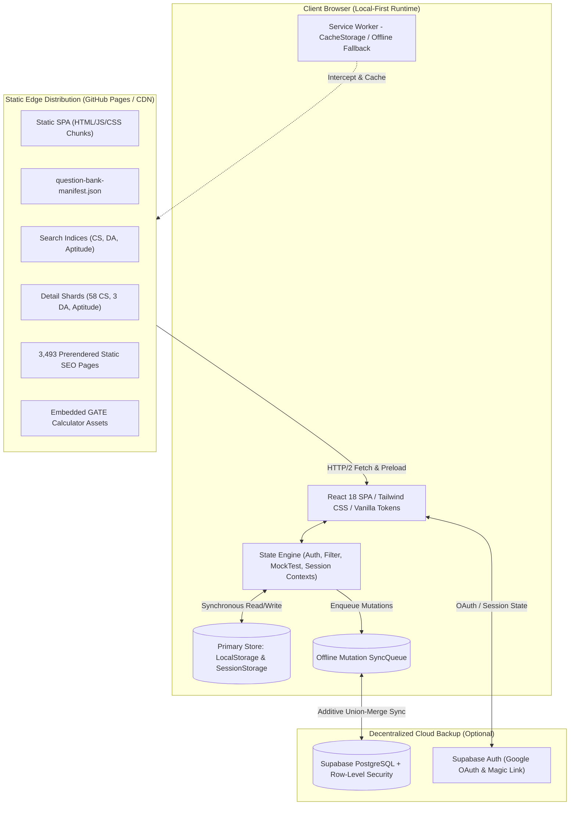
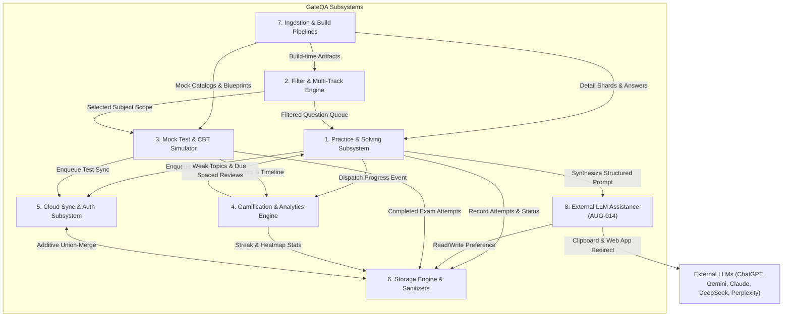
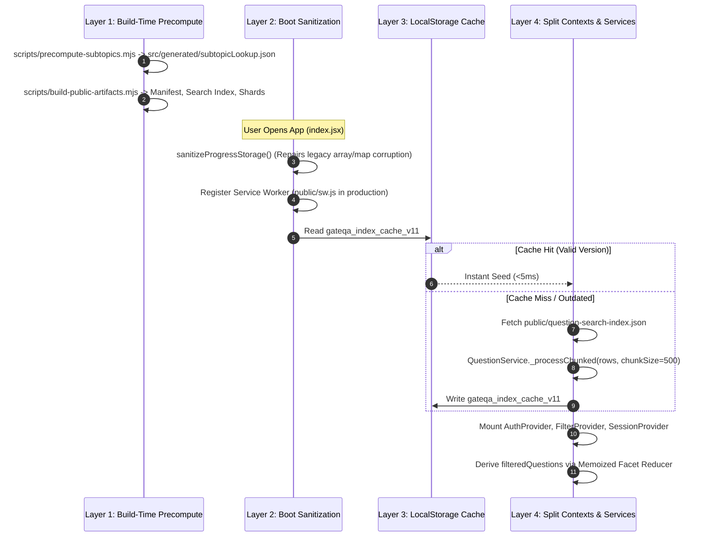
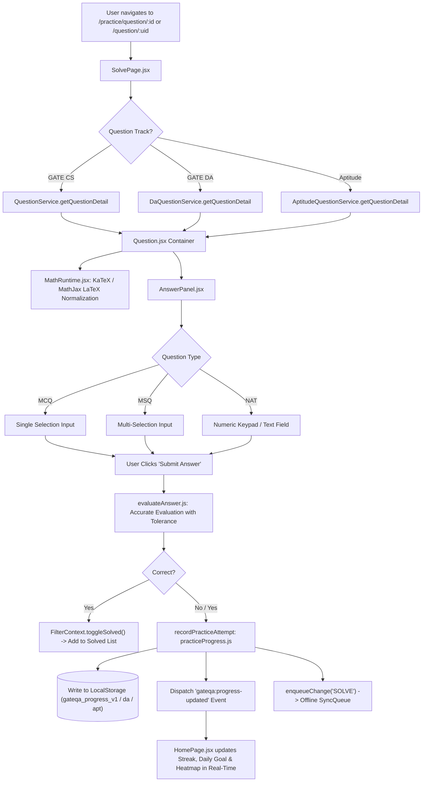
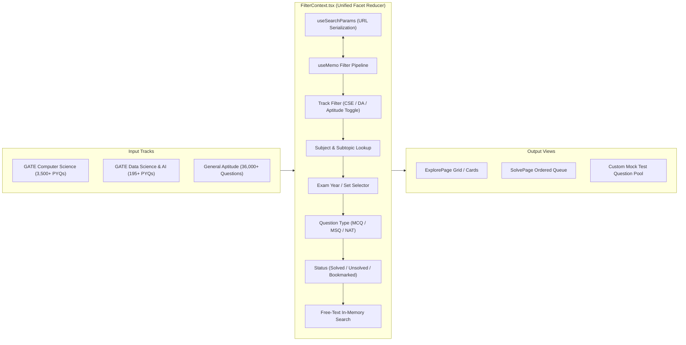
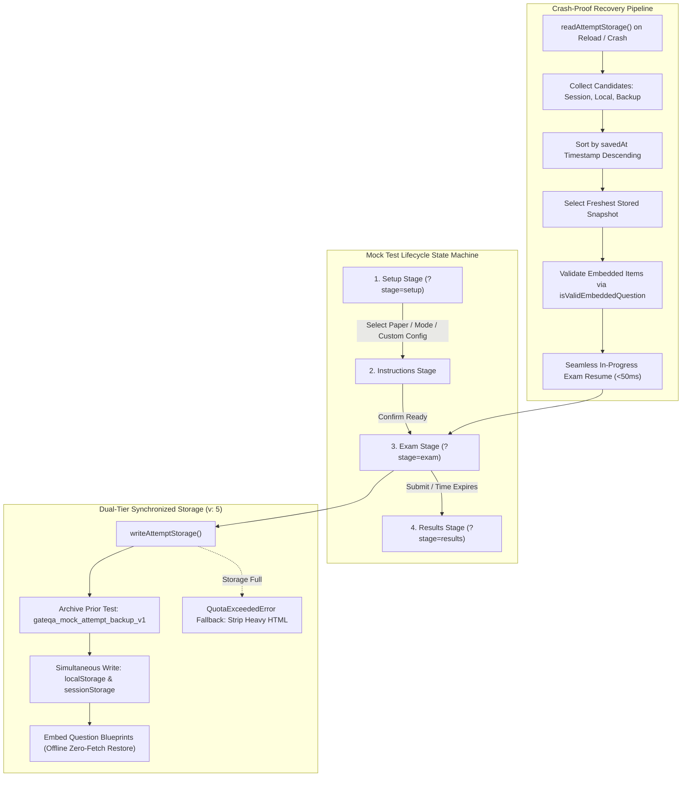
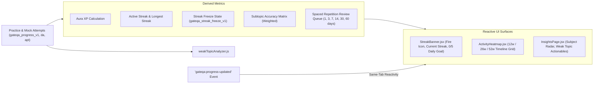
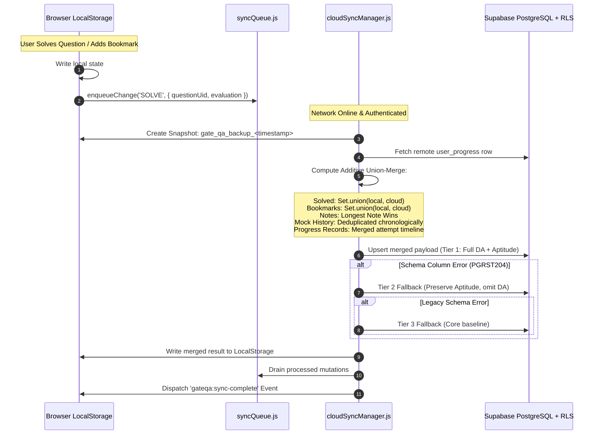
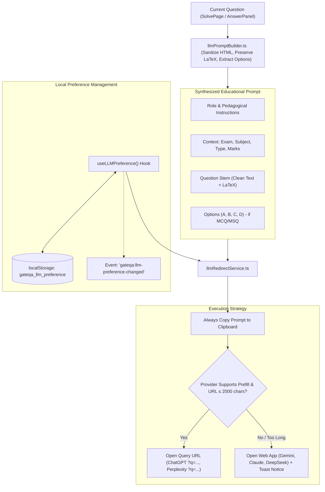
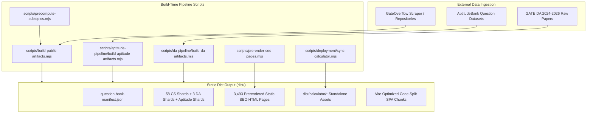

# GateQA System Design & Architecture Specification

> **Platform**: [GateQA (`gateqa.in`)](https://gateqa.in/)  
> **Version**: `1.1.0`  
> **Status**: Living Architectural Baseline  
> **Last Updated**: 2026-08-15  

---

## 1. Executive Summary & Core Architectural Invariants

GateQA is a **local-first, static fast-delivery, offline-capable Single Page Application (SPA)** engineered for GATE Computer Science (CSE), Data Science & AI (DA), and General Aptitude preparation. It provides instantaneous question solving, CBT-grade full-length and topic-wise mock tests, AI-driven performance analytics, and gamification with zero required onboarding friction.



### Core Non-Negotiable Architectural Invariants

1. **Local-First & Zero Friction**:
   - `localStorage` is ALWAYS the primary, zero-latency source of truth for all user progress, answers, bookmarks, notes, test attempts, streaks, and settings.
   - The application functions 100% offline without network connectivity.
   - **Guest Mode is permanent and default**: No user is ever blocked or forced to authenticate to solve questions, take mock tests, or analyze performance.
2. **Zero Data Loss Invariant**:
   - Signing out, clearing cloud sessions, or closing browser tabs **NEVER** purges local user data.
   - Before any cloud merge occurs, an automated local pre-merge snapshot (`gate_qa_backup_<timestamp>`) is written to `localStorage`.
   - Cloud synchronization utilizes an **additive-only union-merge algorithm** (`src/utils/cloudSyncManager.js`) preventing cloud state from truncating or overwriting local study records.
3. **Static Sharded Delivery Model**:
   - All question banks (3,500+ GATE CS, 36,000+ Aptitude, 195+ GATE DA) are pre-indexed, split into discrete shards, and served statically from CDN/GitHub Pages at build time.
   - Zero dynamic database queries are needed for question rendering or filtering.
   - Over 3,493 static SEO HTML pages are pre-rendered at build time with structured JSON-LD schema markups.

---

## 2. High-Level Subsystem Topology & Connections

GateQA is decomposed into 8 tightly integrated subsystems:



---

## 3. Four-Layer Runtime Initialization Model

To eliminate main-thread blocking and guarantee instantaneous time-to-interactive (TTI), GateQA executes a four-layer initialization pipeline:



### Layer Details

| Layer | Responsibility | Key Files | Performance Guarantee |
| :--- | :--- | :--- | :--- |
| **Layer 1: Build-Time Precompute** | Pre-calculates 445+ subtopic aliases, subjects, and regex lookup tables into static JSON. | `scripts/precompute-subtopics.mjs`, `src/generated/subtopicLookup.json` | 0ms runtime regex overhead. |
| **Layer 2: Storage Sanitization** | Self-healing sanitizer runs before React mounts; fixes corrupted JSON, numeric array keys, and restores string arrays. | `src/index.jsx`, `src/utils/storageSanitizer.js` | 100% crash-proof storage boot. |
| **Layer 3: LocalStorage Cache** | Stores chunked search indices under `gateqa_index_cache_v11` and full bank under `gateqa_full_bank_cache_v11`. | `src/services/QuestionService.js`, `src/utils/localStorageState.js` | Sub-5ms instant initial search render. |
| **Layer 4: Split Contexts & Chunking** | Splits state and actions (`FilterStateContext`, `FilterActionsContext`) and yields to main loop with `setTimeout(0)`. | `src/contexts/FilterContext.tsx`, `src/services/QuestionService.js` | Zero long-frame UI freezes. |

---

## 4. Deep Dive: Core Subsystems & Data Flow

### 4.1 Practice & Question Solving Subsystem

The Practice subsystem manages exploration, question rendering, interactive answer input, real-time evaluation, and status updates.



#### Key Routing & Tracking Contracts
- **Canonical Route Patterns**:
  - `/practice`: Main question exploration and multi-filter matrix.
  - `/practice/question/:id`: Canonical practice solve view with full queue navigation.
  - `/question/:uid`: Direct universal question URL (aliases `go:1767`, `APT-ENG-0001`, `da:2024:q-probability`).
- **Evaluation Engine (`src/utils/evaluateAnswer.js`)**:
  - **MCQ**: Strict string/choice comparison against single valid key.
  - **MSQ**: Strict multi-set equality check (`Array.from(setA).sort() === Array.from(setB).sort()`).
  - **NAT**: Handles numeric precision, tolerance ranges (`answer - abs <= input <= answer + abs`), and edge cases (e.g. numeric `0` preservation).

---

### 4.2 Filter & Multi-Track Engine

The Filter subsystem handles faceted question search across three distinct tracks without schema collisions:



#### Multi-Track Identity Contract (`src/utils/examTrack.js`)
- **GATE CSE**: UIDs formatted as `go:<id>` or `cse:<year>:<set>:<section>:<qnum>`.
- **GATE DA**: UIDs formatted as `da:<year>:<slug>` or `da:2026:set-1:q1`.
- **Aptitude**: UIDs formatted as `APT-<CATEGORY>-<INDEX>` (e.g. `APT-ENG-0001`, `APT-QA-0120`).

---

### 4.3 Mock Test & CBT Simulator Subsystem (AUG-013 Zero-Data-Loss Architecture)

The Mock Test engine replicates the authentic GATE TCS iON Computer Based Test (CBT) user interface with high-reliability persistence.



#### Scoring & Evaluation Rules
$$\text{Score} = \sum \text{Correct Marks} - \sum \text{Negative Penalties}$$
- **1-Mark MCQ**: $+1.0$ mark for correct; $-\frac{1}{3}$ mark penalty for incorrect.
- **2-Mark MCQ**: $+2.0$ marks for correct; $-\frac{2}{3}$ mark penalty for incorrect.
- **MSQ / NAT**: $+1.0$ or $+2.0$ marks for correct; **$0.0$ penalty** for incorrect.
- **Unattempted**: $0.0$ marks.

---

### 4.4 Gamification & Learning Analytics Subsystem



---

### 4.5 Cloud Sync & Supabase Backend Subsystem

GateQA uses Supabase PostgreSQL for cloud sync. The cloud sync architecture operates on an **additive-only union-merge algorithm**:



---

### 4.6 External LLM Assistance Subsystem (AUG-014)

GateQA provides a lightweight, zero-cost, privacy-first external AI assistance layer in standard Practice mode (`/practice/question/:id`). It constructs a pedagogical, step-by-step reasoning prompt and orchestrates a 1-click redirect / clipboard buffer to the student's chosen AI platform:



---

## 5. Storage Schema & Storage Key Registry

All data stored by GateQA across `localStorage` and `sessionStorage` follows a strict schema versioning contract:

| Key | Storage | Version | Description | Type / Schema |
| :--- | :--- | :--- | :--- | :--- |
| `gateqa_progress_v1` | `localStorage` | `v1` | GATE CS practice question attempt history, review levels, and accuracy. | `Record<string, ProgressEntry>` |
| `gateqa_apt_progress_v1` | `localStorage` | `v1` | Aptitude practice attempt records. | `Record<string, ProgressEntry>` |
| `gateqa_da_progress_v1` | `localStorage` | `v1` | GATE DA practice attempt records. | `Record<string, ProgressEntry>` |
| `gate_qa_solved_questions` | `localStorage` | `v1` | Canonical array of solved GATE CS question UIDs. | `string[]` |
| `gateqa-apt-solved-questions` | `localStorage` | `v1` | Canonical array of solved Aptitude question UIDs. | `string[]` |
| `gate_qa_da_solved_questions` | `localStorage` | `v1` | Canonical array of solved GATE DA question UIDs. | `string[]` |
| `gate_qa_bookmarked_questions` | `localStorage` | `v1` | Array of bookmarked GATE CS question UIDs. | `string[]` |
| `gateqa-apt-bookmarked-questions` | `localStorage` | `v1` | Array of bookmarked Aptitude question UIDs. | `string[]` |
| `gate_qa_da_bookmarked_questions` | `localStorage` | `v1` | Array of bookmarked GATE DA question UIDs. | `string[]` |
| `gate_qa_notes` | `localStorage` | `v1` | User personal notes per question UID. | `Record<string, { text: string, updatedAt: string }>` |
| `gateqa_mock_active_attempt_v1` | `localStorage` & `sessionStorage` | `v5` | In-progress mock exam snapshot, question blueprints, responses, and timer. | `StoredAttemptPayload (v: 5)` |
| `gateqa_mock_attempt_backup_v1` | `localStorage` | `v5` | Automatic archive of previous test attempt prior to new exam creation. | `StoredAttemptPayload (v: 5)` |
| `gateqa_mock_history_v1` | `localStorage` | `v1` | Completed mock test history list, scores, and accuracy breakdowns. | `MockTestHistoryEntry[]` |
| `gateqa_streak_freeze_v1` | `localStorage` | `v1` | Streak freeze inventory and consumption timeline. | `{ available: number, usedDates: string[] }` |
| `gateqa_daily_goal` | `localStorage` | `v1` | Daily question practice goal target (default: 5). | `number` |
| `gateqa_llm_preference` | `localStorage` | `v1` | User's preferred external AI provider (`chatgpt`, `gemini`, `claude`, `deepseek`, `perplexity`). | `string` (default: `"chatgpt"`) |
| `gate_qa_sync_queue` | `localStorage` | `v1` | Offline mutation queue pending cloud synchronization. | `QueuedChange[]` |
| `gate_qa_theme` | `localStorage` | `v1` | Active user theme (`dark`, `light`, `system`). | `string` |

---

## 6. Build & Data Ingestion Pipelines



### Build Commands & Execution Sequence
1. `npm run precompute`: Generates `src/generated/subtopicLookup.json`.
2. `npm run build:artifacts`: Compiles question manifest, mock catalog, search indices, and 58 detail shards.
3. `npm run build:da`: Generates GATE DA manifest and 3 detail shards.
4. `vite build`: Compiles optimized, code-split client SPA chunks with dynamic CSS tokens.
5. `npm run build:seo`: Pre-renders 3,493 crawler-ready static HTML landing and question pages with JSON-LD metadata.
6. `npm run sync:calculator`: Synchronizes standalone virtual calculator assets into `dist/calculator`.

---

## 7. Quality Gates & Verification Standards

To guarantee enterprise-grade stability and prevent regressions, all changes to GateQA must satisfy 5 automated verification gates:

```text
[ Pre-Push Verification Suite ]
├── 1. Unit Tests: vitest run (391+ tests across 59 suites, 100% passing)
├── 2. Strict Typecheck: tsc -p tsconfig.json --noEmit (0 TypeScript errors)
├── 3. Production Build: npm run build (3,493 SEO pages generated)
├── 4. Bundle Budget: npm run qa:validate-bundle-budget (Ensures lightweight chunks)
└── 5. End-to-End Tests: npx playwright test (Verifies core learner journeys)
```

---

## 8. Directory & File Reference Map

```text
GATE_QA/
├── docs/                             # Architectural Specifications & Reports
│   ├── SYSTEM_DESIGN.md              # Master System Design Document (This specification)
│   ├── ARCHITECTURE.md               # Local-First & Cloud Sync Architecture
│   ├── DATABASE.md                   # Supabase PostgreSQL Schema & Migrations
│   ├── BUG_BACKLOG.md                # Comprehensive Issue & Fix Registry
│   └── CHANGELOG.md                  # Chronological Release History
├── .llm-memory/                      # Fast AI Agent Retrieval Memory
│   ├── INDEX.md                      # Index of all memory files
│   ├── system_design.md              # Mirror of system design for LLM retrieval
│   ├── bugs.md                       # Active & resolved bug snapshot
│   ├── decisions.md                  # Historical architectural decision records
│   ├── patterns.md                   # Frontend & pipeline code patterns
│   └── progress.md                   # Current development milestones
├── scripts/                          # Automated Ingestion, Build & Prerender Pipelines
│   ├── build-public-artifacts.mjs    # Generates public manifests, indices & 58 shards
│   ├── precompute-subtopics.mjs      # Precomputes subtopic lookup table
│   ├── prerender-seo-pages.mjs       # Prerenders 3,493 SEO static HTML pages
│   ├── da-pipeline/                  # GATE DA ingestion and shard generator
│   └── aptitude-pipeline/            # Aptitude scraping & artifact generator
├── src/
│   ├── App.jsx                       # Master Router & Context Root
│   ├── index.jsx                     # Entrypoint & storage boot sanitizer
│   ├── components/
│   │   ├── AnswerPanel/              # Input rendering, evaluateAnswer, attempt logging
│   │   ├── Home/                     # StreakBanner, ActivityHeatmap, DailyGoal
│   │   ├── MockTest/                 # MockTestShell, MockTestQuestion, CBT UI
│   │   └── Question/                 # Question container, KaTeX MathContent, Notes
│   ├── contexts/
│   │   ├── AuthContext.jsx           # Supabase Auth, OAuth listeners, session state
│   │   ├── FilterContext.tsx         # Multi-faceted filter state reducer & multi-track
│   │   ├── MockTestContext.tsx       # Zero-Data-Loss CBT state machine & dual storage
│   │   └── SessionContext.jsx        # Ordered queue & random practice session engine
│   ├── services/
│   │   ├── QuestionService.js        # GATE CS detail shard & chunked index loader
│   │   ├── DaQuestionService.js      # GATE DA shard loader
│   │   ├── AptitudeQuestionService.js# Aptitude shard loader
│   │   └── AnswerService.js          # Normalized answer lookup & storage key resolver
│   └── utils/
│       ├── cloudSyncManager.js       # Additive union-merge cloud synchronization engine
│       ├── syncQueue.js              # Offline mutation queue with auto-reconnect drain
│       ├── practiceProgress.js       # Practice attempt logger & 'gateqa:progress-updated'
│       ├── weakTopicAnalyzer.js      # Study activity, streak, and weak topic analytics
│       └── evaluateAnswer.js         # Exact evaluation engine for MCQ, MSQ, and NAT
```
