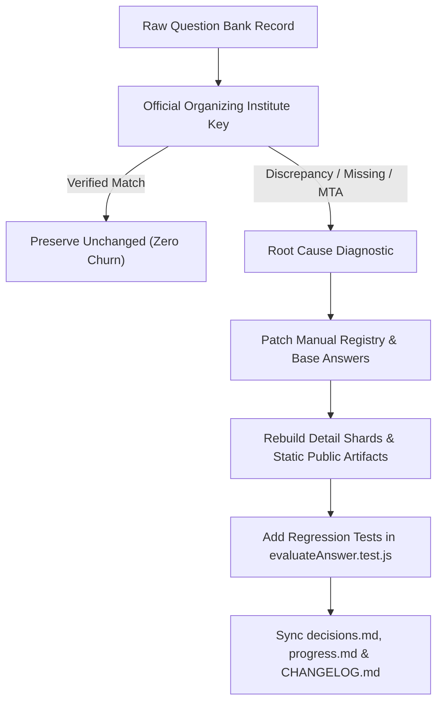
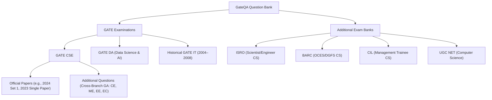
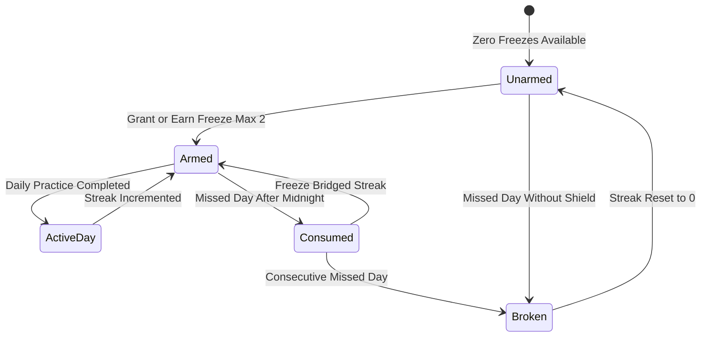
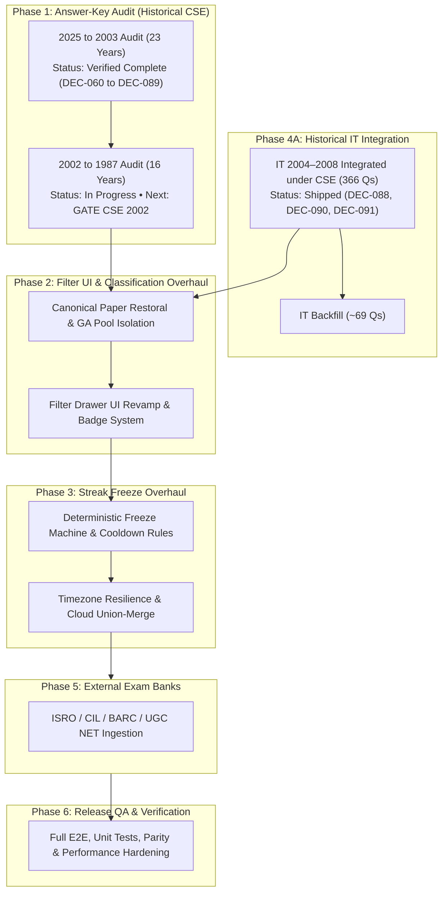

# SEPTEMBER 2026 — GATEQA DATA, FILTER & QUESTION-BANK OVERHAUL

> **Status:** Active Master Plan · September 2026  
> **Scope:** Data Quality, Source Provenance, Filter Classification, Freeze Rules & Exam Bank Expansion  
> **Core Principle:** *GateQA's data model must represent the actual source and provenance of every question. Never let "stored in a CSE JSON file" become equivalent to "official GATE CSE question."*

---

## Executive Summary

During September 2026, GateQA is undergoing a structured product and data-quality overhaul across six core functional areas:
1. **Complete Answer-Key Audit (All GATE Years)**: Systematic historical verification against official answer keys and authoritative references (2025 backward to 1987). **2025 through 2003 is 100% audited and verified.**
2. **Filter Section UI + Data-Classification Overhaul**: Eliminating invented CSE sets, separating Genuine Official Papers from Additional Questions (cross-branch GA), and preserving origin provenance.
3. **Freeze Rules Overhaul**: Redesigning the streak Freeze mechanic into an intuitive, deterministic, and abuse-resistant system across timezone boundaries and cloud sync.
4. **Historical IT Paper Provenance & Expansion (2004–2008)**: Isolating historical GATE IT questions from CSE shards, completing missing questions, and exposing IT branch practice.
5. **Additional Competitive Exam Question Banks**: Ingesting cleanly isolated external exam banks (ISRO, CIL, BARC, UGC NET).
6. **Explore Questions Page — Vertical Space Utilization Optimization**: Streamlining the Explore page header, search row, practice mode controls, and active filter chips to maximize visible question content above the fold across mobile and desktop viewports.

---

## 1. Complete Answer-Key Audit — All GATE Years

### 1.1 Problem Statement & Scope
- Multiple historical question banks contained subtle discrepancies (typos, misaligned options, shifted NAT tolerances, unpopulated answer keys, or wrong single-choice conversions).
- Individual piecemeal fixes are insufficient; the historical question bank requires an exhaustive, question-by-question audit.
- **Audit Progress to Date:**
  - ✅ **GATE 2025 backward through GATE 2003 (23 consecutive examination years)** are 100% audited, corrected, and verified against official organizing institute keys and GateOverflow consensus ([`DEC-060`](file:///.llm-memory/decisions.md) through [`DEC-089`](file:///.llm-memory/decisions.md)).
  - 🔄 **Remaining Scope:** Historical years **1987–2002 (16 examination years, 571 questions)**.
  - 🎯 **Next Immediate Target:** **GATE CSE 2002** (48 questions).

### 1.2 Historical CSE Audit Progress & Tracking Matrix

| Year | Exam Format / Structure | Questions in Bank | Status | Key Focus Areas / Notes |
|:---:|:---|:---:|:---:|:---|
| **2025** | 2 Sessions (65 Qs each) | 130 | ✅ Complete | Set 1 & Set 2 audited ([`DEC-060`](file:///.llm-memory/decisions.md), [`DEC-062`](file:///.llm-memory/decisions.md)) |
| **2024** | 2 Sessions (65 Qs each) | 130 | ✅ Complete | Session 1 & 2 audited ([`DEC-065`](file:///.llm-memory/decisions.md)) |
| **2023** | 1 Canonical Session (65 Qs) | 65 | ✅ Complete | Single paper restoral, GA decoupled ([`DEC-066`](file:///.llm-memory/decisions.md)) |
| **2022** | 1 Session (65 Qs) | 65 | ✅ Complete | Audited & verified ([`DEC-067`](file:///.llm-memory/decisions.md)) |
| **2021** | 2 Sessions (65 Qs each) | 130 | ✅ Complete | Multi-range NAT & multi-option keys ([`DEC-068`](file:///.llm-memory/decisions.md)) |
| **2020** | 1 Session (65 Qs) | 65 | ✅ Complete | Audited & verified ([`DEC-069`](file:///.llm-memory/decisions.md)) |
| **2019** | 1 Session (65 Qs) | 65 | ✅ Complete | Audited & verified ([`DEC-070`](file:///.llm-memory/decisions.md)) |
| **2018** | 1 Session (65 Qs) | 65 | ✅ Complete | Audited & verified ([`DEC-071`](file:///.llm-memory/decisions.md)) |
| **2017** | 2 Sessions (65 Qs each) | 130 | ✅ Complete | Set 1 & Set 2 audited ([`DEC-072`](file:///.llm-memory/decisions.md), [`DEC-073`](file:///.llm-memory/decisions.md)) |
| **2016** | 2 Sessions (65 Qs each) | 130 | ✅ Complete | Session 1 & 2 audited ([`DEC-074`](file:///.llm-memory/decisions.md)) |
| **2015** | 3 Sessions (65 Qs each) | 195 | ✅ Complete | Sets 1, 2, 3 audited & populated ([`DEC-075`](file:///.llm-memory/decisions.md)–[`DEC-077`](file:///.llm-memory/decisions.md)) |
| **2014** | 3 Sessions (65 Qs each) | 195 | ✅ Complete | Sets 1, 2, 3 audited & backfilled ([`DEC-078`](file:///.llm-memory/decisions.md)) |
| **2013** | 1 Session (65 Qs) | 65 | ✅ Complete | Audited & MTAs patched ([`DEC-079`](file:///.llm-memory/decisions.md)) |
| **2012** | 1 Session (65 Qs) | 65 | ✅ Complete | Audited & MTAs patched ([`DEC-080`](file:///.llm-memory/decisions.md)) |
| **2011** | 1 Session (65 Qs) | 65 | ✅ Complete | Audited & year tags normalized ([`DEC-081`](file:///.llm-memory/decisions.md)) |
| **2010** | 1 Session (65 Qs) | 65 | ✅ Complete | Audited & missing keys backfilled ([`DEC-082`](file:///.llm-memory/decisions.md)) |
| **2009** | 1 Session (60 Qs pre-2010) | 60 | ✅ Complete | Audited & MTAs patched ([`DEC-083`](file:///.llm-memory/decisions.md)) |
| **2008** | 1 Session (85 Qs) | 85 | ✅ Complete | Q21 restored, 85/85 scorable ([`DEC-084`](file:///.llm-memory/decisions.md)) |
| **2007** | 1 Session (85 Qs) | 85 | ✅ Complete | Q26 restored, 85/85 scorable ([`DEC-085`](file:///.llm-memory/decisions.md)) |
| **2006** | 1 Session (85 Qs) | 85 | ✅ Complete | Missing answers populated ([`DEC-086`](file:///.llm-memory/decisions.md)) |
| **2005** | 1 Session (90 Qs) | 90 | ✅ Complete | Standalone + linked questions ([`DEC-087`](file:///.llm-memory/decisions.md)) |
| **2004** | 1 Session (90 Qs) | 90 | ✅ Complete | Q22 restored, 90/90 scorable ([`DEC-088`](file:///.llm-memory/decisions.md)) |
| **2003** | 1 Session (90 Qs) | 90 | ✅ Complete | 12 keys/MTAs corrected ([`DEC-089`](file:///.llm-memory/decisions.md)) |
| **2002** | 1 Session (Legacy format) | 48 | ⏳ **Next Target** | Verify stems, options, and keys against GO reference |
| **2001** | 1 Session (Legacy format) | 49 | ⏳ Pending | Verify stems, options, and keys against GO reference |
| **2000** | 1 Session (Legacy format) | 44 | ⏳ Pending | Verify stems, options, and keys against GO reference |
| **1999** | 1 Session (Legacy format) | 51 | ⏳ Pending | Verify stems, options, and keys against GO reference |
| **1998** | 1 Session (Legacy format) | 54 | ⏳ Pending | Verify stems, options, and keys against GO reference |
| **1997** | 1 Session (Legacy format) | 57 | ⏳ Pending | Verify stems, options, and keys against GO reference |
| **1996** | 1 Session (Legacy format) | 56 | ⏳ Pending | Verify stems, options, and keys against GO reference |
| **1995** | 1 Session (Legacy format) | 51 | ⏳ Pending | Verify stems, options, and keys against GO reference |
| **1994** | 1 Session (Legacy format) | 36 | ⏳ Pending | Verify stems, options, and keys against GO reference |
| **1993** | 1 Session (Legacy format) | 36 | ⏳ Pending | Verify stems, options, and keys against GO reference |
| **1992** | 1 Session (Legacy format) | 12 | ⏳ Pending | Legacy sub-questions / fill-in-the-blanks |
| **1991** | 1 Session (Legacy format) | 8 | ⏳ Pending | Legacy sub-questions / fill-in-the-blanks |
| **1990** | 1 Session (Legacy format) | 17 | ⏳ Pending | Verify True/False and option representations |
| **1989** | 1 Session (Legacy format) | 8 | ⏳ Pending | Legacy sub-questions / fill-in-the-blanks |
| **1988** | 1 Session (Legacy format) | 3 | ⏳ Pending | Legacy sub-questions / fill-in-the-blanks |
| **1987** | 1 Session (Legacy format) | 41 | ⏳ Pending | Verify True/False and option representations |

### 1.3 Verification Hierarchy & Methodology
Every question's answer must be audited against authoritative sources in strict priority order:
1. **Official GATE Answer Key** (Organizing Institute)
2. **Official GATE Question Paper**
3. **GateOverflow** (Community consensus + verified answer key discussion threads)
4. **PracticePaper.in**
5. **Standard Academic Reference Texts** (Cormen, Tanenbaum, Galvin, Ullman, Korth, etc.)



### 1.4 Verification Checklist per Question
For every single audited question, verify and validate:
- `question_uid`
- `year` (normalized to integer format)
- `set` / `session`
- `question_number`
- `question_type` (MCQ / MSQ / NAT / MTA)
- Options content & alphabetical ordering
- Stored answer in database/JSON
- Official/verified answer
- NAT accepted numerical tolerance range `[min, max]` where applicable

### 1.5 Special Handling & Root Cause Diagnostics
- Check MCQ, MSQ, and NAT questions separately.
- Do not assume answers are solely single letters `A/B/C/D`.
- Correctly preserve Marks To All (`MTA`), multi-option keys (e.g. `A;C` or `A or B`), and numerical intervals.
- Identify the exact root cause of discrepancies:
  - Incorrect raw JSON answer value
  - Shuffled / incorrect option ordering
  - 0-based vs 1-based indexing conversion errors
  - Question-to-answer mapping / alignment mismatch
  - Duplicate UID collisions
  - Scraper / parser / import serialization artifact
  - Runtime answer evaluation bug
- **Never patch individual UIDs blindly** without identifying and recording the root cause.

---

## 2. Filter Section UI + Data-Classification Overhaul

### 2.1 Core Problem
The legacy year/set filter exhibited confusing classifications due to conflating:
- Genuine multi-session CSE papers (e.g., 2024 Set 1, Set 2)
- Single official CSE papers (e.g., 2023 single paper)
- Additional General Aptitude (GA) questions sourced from non-CS branches (ME, CE, EE, EC, IN, etc.)

### 2.2 Classification Architecture & Hierarchy



### 2.3 Data Contract & Provenance Schema
To prevent cross-branch conflation, every question record strictly carries:
```typescript
interface QuestionMetadata {
  exam: "GATE" | "ISRO" | "BARC" | "CIL" | "UGC_NET";
  branch: "CSE" | "DA" | "IT" | "ECE" | "ME" | "CE" | "EE";
  paper_scope: "official_cse" | "official_da" | "official_it" | "additional_ga" | "external_exam";
  origin_branch?: string;    // e.g. "CE", "ME" for additional GA questions
  origin_year?: number;      // Original year of the paper
  origin_session?: number;   // Original session/set number
}
```

### 2.4 UI & UX Requirements for Filter Drawer
- **Strict Grouping:** Clear visual separation between `Official Examination Papers` and `Additional Questions (Cross-Branch GA)`.
- **Badges:** Amber `GA • Additional` badges for non-CSE GA practice items.
- **Accurate Counter Parity:** Active filter chips and year counters must match the scorable items returned by `QuestionService`.
- **State Serialization:** URL search parameters (`?year=...&set=...`) must deterministically reflect and restore filter selections.
- **Full Isolation:** Selecting an official paper returns **only** questions belonging to that official paper.

### 2.5 Explore Questions Page — Vertical Space Utilization & Layout Optimization

#### Problem Statement
The current Explore page layout ([`src/pages/ExplorePage.jsx`](file:///src/pages/ExplorePage.jsx)) stacks multiple bulky controls vertically above the question list:
1. Large page title (`h1`) and result count summary text.
2. Large action buttons (`Quick Start` and mobile `Filters` trigger).
3. Dedicated practice mode row (`Practice mode`, `In Order / Shuffled`, `Filters applied`).
4. Full-width search input row with separate margins and borders.
5. Multi-line active filter chips area.

On standard laptop viewports (e.g., 1366×768 or 1080p with browser toolbars) and mobile devices, this vertical sprawl consumes excessive screen height before the user sees the first question card, requiring unnecessary vertical scrolling to start solving.

#### Key Optimization Objectives
- **Consolidate Header & Actions:** Inline the page heading, result count, and primary actions (`Quick Start`, `Filter` button) into a tight, responsive top toolbar.
- **Merge Search Bar & Practice Toggles:** Integrate search input and mode toggles into a unified single-row control bar rather than separate stacked rows separated by full-width divider borders.
- **Streamline Active Filter Chips:** Present active filter chips in a compact ribbon with a clear "Clear all" button, preventing vertical height inflation when multiple subjects/years are selected.
- **Question Card Density:** Optimize vertical padding in [`QuestionResultCard.jsx`](file:///src/components/Practice/QuestionResultCard.jsx) and list margins in [`QuestionPickerList.jsx`](file:///src/components/Practice/QuestionPickerList.jsx) without compromising readability, code block clarity, or touch targets.
- **Above-the-Fold Delivery:** Guarantee that at least 1–2 complete question cards are immediately visible within a standard 768px viewport height upon loading.

---

## 3. Freeze Rules Overhaul

### 3.1 Architectural Review & Motivation
The Day Streak Freeze system preserves an active study habit when life interruptions prevent daily practice. The legacy implementation needs modernization to be:
1. **Abuse-Resistant:** Capped maximum capacity (e.g., max 2 active freezes).
2. **Deterministic:** Evaluated uniformly across local storage and Supabase Cloud Sync without race conditions.
3. **Timezone-Resilient:** Evaluated based on user local calendar days crossing midnight, using ISO date strings (`YYYY-MM-DD`).

### 3.2 Freeze State Machine



### 3.3 Core Rules & Invariants
- **Protection Scope:** Protects the streak counter integer from resetting to 0. It does **not** fabricate solved question counts or simulate daily target completion.
- **Streak Continuity:** A consumed freeze on Day `N+1` bridges Day `N` to Day `N+2`. The streak count continues, with Day `N+1` recorded with status `frozen` (0 questions solved).
- **Cloud Sync Merge Rule:** Additive union-merge preserves the maximum earned freeze count and the latest `last_freeze_date` without duplicate consumption.
- **Visual Feedback:** Distinct UI indicator in header/profile showing:
  - 🔵 **Freeze Armed** (Shield active, ready to protect)
  - 🧊 **Freeze Consumed** (Notification explaining streak was saved for date `YYYY-MM-DD`)
  - ⚪ **No Freeze Available** (Warning banner when streak is unprotected)

---

## 4. Historical + Additional Question Paper Expansion

### 4.1 Historical GATE IT Papers (2004–2008)

#### Milestone 4A Completed:
1. **Provenance Separation:** Discovered and extracted **366 historical GATE IT questions** previously co-mingled inside GATE CSE shards (`2004-s0` to `2008-s0`) under `paper_scope: "official_cse"`.
2. **Dedicated Datasets Created:** Extracted into standalone files in both `data/it/` (source) and `public/data/it/` (static edge distribution) via [`extract-it-papers.mjs`](file:///scripts/pipeline/extract-it-papers.mjs):
   - `gateit-2004.json` (73 Qs)
   - `gateit-2005.json` (81 Qs)
   - `gateit-2006.json` (70 Qs)
   - `gateit-2007.json` (68 Qs)
   - `gateit-2008.json` (74 Qs)
   - `gateit-all.json` (366 Qs consolidated)
   - `answers-gateit.json` (366 UID-keyed verified answer key map)
3. **Quality & Validation:** All 829 unit tests pass, and public parity validated across 3,552 records ([`DEC-088`](file:///.llm-memory/decisions.md), [`DEC-090`](file:///.llm-memory/decisions.md), [`DEC-091`](file:///.llm-memory/decisions.md)).

#### Milestone 4B: Historical Paper Separation & Provenance (Completed — DEC-091, DEC-092):
- **User Architecture Decision:** Do **not** merge separate historical CSE and IT papers into a single category. During 2004–2008, CSE and IT were distinct examinations with separate papers.
- **Filter Representation:**
  - For the CSE filter, the primary year option remains simply: `2008`, `2007`, `2006`, `2005`, `2004` (never `CSE + IT`).
  - Next to those years, a small cyan **`[IT]`** badge is displayed as an informational availability indicator (`"An IT paper is also available for this year"`).
  - **Critical Invariant:** The IT badge is informational. Selecting `2005` in the CSE filter returns **2005 CSE questions only** (90 questions). It never returns IT questions.
  - Filtering `CSE + 2005` $\rightarrow$ CSE 2005 only (90 Qs); `IT + 2005` $\rightarrow$ IT 2005 only (81 Qs).
- **Data & Shard Architecture:**
  - `public/question-detail-shards/2004-s0.json` through `2008-s0.json` contain **only** official CSE questions (90, 90, 85, 85, 85 questions).
  - Dedicated IT detail shards created: `it-2004-s0.json` through `it-2008-s0.json` (73, 81, 70, 68, 74 questions).
  - `manifest.yearSets` maintains separate identities: `cse:YYYY:set-0` and `it:YYYY:set-0`, with `hasItPaper: true` on CSE entries.
  - Verified across 15 automated regression requirements in [`src/tests/historicalCseItSeparation.test.js`](file:///src/tests/historicalCseItSeparation.test.js).
- **Remaining Follow-up:**
  - [ ] **Backfill Missing ~69 IT Questions:**
    - GATE IT 2004: 17 questions missing (Current: 73 / Official: 90)
    - GATE IT 2005: 9 questions missing (Current: 81 / Official: 90)
    - GATE IT 2006: 15 questions missing (Current: 70 / Official: 85)
    - GATE IT 2007: 17 questions missing (Current: 68 / Official: 85)
    - GATE IT 2008: 11 questions missing (Current: 74 / Official: 85)

### 4.2 Additional Competitive Exam Question Banks (ISRO, CIL, BARC, UGC NET)
Standalone question bank modules for major national exams:
- **ISRO** (Scientist/Engineer 'SC' - Computer Science)
- **CIL** (Coal India Limited - Management Trainee CS)
- **BARC** (Scientific Officer - OCES/DGFS CS)
- **UGC NET** (Computer Science & Applications - Paper 2 & 3)

#### Data Namespacing Standard
All external exam questions follow strict namespacing to eliminate UID collisions:
- `isro:cs:2020:q15`
- `barc:cs:2021:q42`
- `cil:cs:2022:q08`
- `ugcnet:cs:2023-dec:p2:q31`

---

## 5. Global Data-Integrity Invariants

- **Zero Data Loss:** Never invalidate or corrupt user progress:
  - Persistent `question_uid` references (`go:<id>` or namespaced format)
  - Solved / Attempted statuses
  - Bookmarks and starred questions
  - User notes
  - Practice history logs
  - Tracker metrics & revision counters
  - Mock test history and analytics
- **Strict Stream Isolation:** Complete separation between GATE CSE, GATE DA, GATE IT, and External Exams.
- **Additive Union-Merge:** Cloud sync always takes the superset of local and remote progress ([`src/utils/cloudSyncManager.js`](file:///src/utils/cloudSyncManager.js)).
- **Static Delivery:** All shards and public indices pre-rendered at build time.

---

## 6. September Execution Order



### Granular Execution Roadmap

1. **Phase 1: Complete Answer-Key Audit (2002 backward to 1987)**
   - Audit 2002 (48 Qs) $\rightarrow$ 2001 (49 Qs) $\rightarrow$ 2000 (44 Qs) $\rightarrow$ 1999 (51 Qs) $\rightarrow$ 1998–1987.
   - Patch `manual-answers-patch-v1.json`, rebuild shards, normalize year numbers, add regression unit tests.
2. **Phase 4A Follow-up: Historical IT Decoupling & UI Integration**
   - Decouple CSE shards `2004-s0` through `2008-s0`.
   - Ingest missing ~69 IT questions.
   - Add IT branch toggle to Filter drawer and Custom Mock Builder.
3. **Phase 2: Filter Section UI + Data-Classification Overhaul**
   - Implement `Official Papers` vs `Additional Questions` visual grouping.
   - Polish filter chips, URL query param serialization, and solved/unsolved toggles.
   - **Vertical Space Utilization Optimization**: Streamline Explore Questions page controls, inline search with practice mode toggles, and maximize visible question content above the fold.
4. **Phase 3: Freeze Rules Overhaul**
   - Refactor `practiceProgress.js` freeze state machine, timezone calendar day logic, and Supabase sync.
   - Build UI freeze indicator and notification banner.
5. **Phase 5: External Exam Question Banks**
   - Ingest ISRO, CIL, BARC, UGC NET with isolated namespaces.
6. **Phase 6: End-to-End Verification & Reporting**
   - Run unit tests, E2E suite, typecheck, data parity check, and generate final audit reports.

---

## 7. Required Final Verification & Deliverables

Before concluding each phase, execute the full verification suite:
- [ ] `npm run qa:validate-data`: Zero orphan answers, perfect data parity.
- [ ] `npm run qa:validate-public-parity`: All public artifacts in 100% lockstep.
- [ ] `npm run test:unit`: Full unit test suite passing (827+ tests).
- [ ] `npm run test:e2e`: Playwright accessibility and user flow suite.
- [ ] `npm run typecheck`: TypeScript verification (0 errors).
- [ ] `npm run build`: Production bundle and static SEO pages prerendered clean.

### Final Audit Deliverables
1. **Answer-Key Audit Report:** Years audited, verified questions count, corrections made, root cause analysis, affected files.
2. **Filter Overhaul Report:** Reclassified years, migrated records, created Additional Questions pools, preserved official papers.
3. **Freeze Overhaul Report:** Old rules vs new rules specification, state machine tests, timezone edge case verification.
4. **Question-Bank Expansion Report:** IT 2004–2008 completion stats, added ISRO/CIL/BARC/UGC NET papers, provenance references.
5. **Regression & Quality Report:** Unit tests, E2E tests, typecheck, static build output, and data validation logs.
